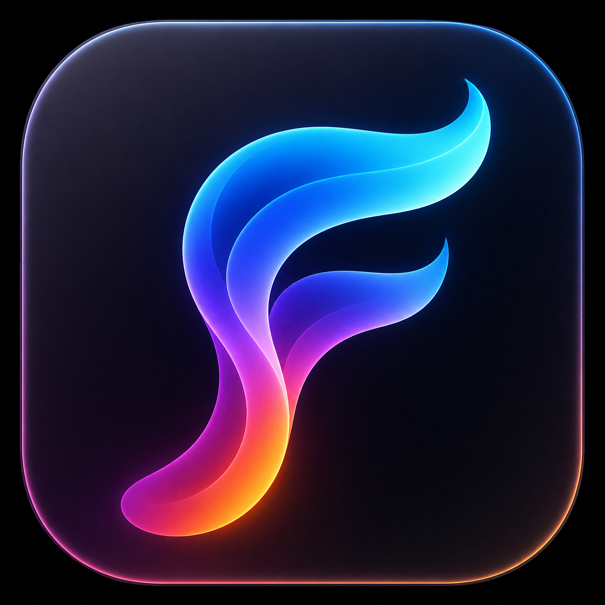

# FuguFableFlow

FuguFableFlow is a tiny macOS menu-bar dictation app built for people who want speech-to-text without a heavy desktop assistant sitting in memory all day.

It is built from scratch in Swift and SwiftUI. It is not affiliated with, endorsed by, or based on code/assets from any commercial dictation product.



The app icon was generated with GPT Image 2 and is approved for publishing with this project.

## The name

`FuguFableFlow` is what happens when you ask a product meeting to name a tiny dictation app after three coffees and too many tabs open.

It is named from the most buzzwordy, clickbaity, clout-chasing, trendjacking keywords currently contaminating our feeds, plus "Flow," because apparently every productivity tool must now imply enlightenment through keyboard shortcuts.

The name is maximalist. The app is not.

## Why this exists

Most voice tools are optimized for broad assistant workflows. FuguFableFlow is intentionally narrower:

- live only in the menu bar
- start listening only when you ask it to
- paste the result into the current app
- release speech/audio resources when dictation stops
- stay small under memory pressure

On the original development machine, FuguFableFlow idled around 16 MB in Activity Monitor after launch. That number will vary by macOS version, hardware, signing mode, and active features, but the design goal is explicit: avoid a large always-on memory footprint.

## Features

- Menu-bar-only macOS app with no Dock icon or main window.
- Push-to-talk dictation with Right Command hold by default.
- Configurable dictation shortcuts in Settings.
- Automatic paste on stop, with optional clipboard restoration.
- Copy Last Transcript fallback when paste is blocked by macOS permissions.
- Best-available microphone selection helper for built-in mics, USB interfaces, and virtual devices.
- Smart Formatting for spoken punctuation, line breaks, simple false starts, list formatting, and writing style cleanup.
- Custom dictionary for names, project terms, libraries, commands, and unusual words.
- Coding command recognition for terms like new line, open parenthesis, fat arrow, and press enter.
- Command Mode for transforming selected text or generating text at the cursor with Off, OpenRouter, Hugging Face, OpenAI, or Local Ollama providers.
- Optional music muting that pauses Music, Spotify, Spotify tabs in Chrome, and attempts system-output mute for browser players.
- Configurable start/stop notification sounds with preview and notification volume.
- Memory pressure monitor that clears idle state and stops recording on critical pressure.
- Custom app icon and menu-bar logo.

## Memory-first design

FuguFableFlow keeps its memory profile low by avoiding work when idle:

- Speech recognition services are created only while recording.
- Audio engine, recognition request, and recognition task are released on stop.
- Transcript preview is capped.
- No long-term transcript history is retained.
- There is no main app window, webview, Electron shell, or background assistant UI.
- A memory-pressure monitor reacts to system pressure and cleans up recording state.

To inspect memory locally:

```bash
ps -o pid,rss,command -p "$(pgrep -x FuguFableFlow)"
```

`rss` is reported in KB. Activity Monitor is usually easier for a quick human check.

## Requirements

- macOS 14 or newer
- Swift 6 toolchain / Xcode command line tools
- Microphone permission
- Speech Recognition permission
- Accessibility permission for automatic paste into other apps
- Optional: provider API key for hosted Command Mode providers

## Build and run

```bash
git clone https://github.com/mattyatplay-coder/FuguFableFlow.git
cd FuguFableFlow
./script/build_and_run.sh
```

The script builds a signed local app bundle at:

```text
dist/FuguFableFlow.app
```

By default it uses ad-hoc signing. To use a specific Apple signing identity:

```bash
FUGUFABLEFLOW_CODESIGN_IDENTITY="Apple Development: Your Name (TEAMID)" ./script/build_and_run.sh
```

To install the built app manually:

```bash
rm -rf /Applications/FuguFableFlow.app
ditto dist/FuguFableFlow.app /Applications/FuguFableFlow.app
open /Applications/FuguFableFlow.app
```

## Permissions

macOS may ask for permissions in different places:

- Microphone: allows audio capture.
- Speech Recognition: allows Apple's speech recognizer to transcribe audio.
- Accessibility: allows FuguFableFlow to paste text into the active app.
- Automation: allows optional control of Music, Spotify, or Chrome for music muting.

If paste does not work, open System Settings and confirm FuguFableFlow is enabled under Accessibility.

Spotify in Chrome requires Chrome's `View > Developer > Allow JavaScript from Apple Events` setting before FuguFableFlow can pause or resume the web player.

## Shortcuts

Default dictation shortcut:

```text
Right Command hold
```

Command Mode shortcut:

```text
Control + Option + Command hold
```

You can change the dictation shortcut in Settings.

## Command Mode

Command Mode is optional and is off by default. It can:

- replace highlighted text with a cleaned-up or transformed version
- generate text at the cursor when nothing is selected
- follow spoken instructions like "make this more concise" or "turn this into a bulleted list"

Provider choices:

- Off: no AI provider is called.
- OpenRouter: hosted API with low-cost and free model routing options.
- Hugging Face: hosted open-model inference through Hugging Face Inference Providers.
- OpenAI: hosted OpenAI chat completions.
- Local Ollama: calls an already-running local Ollama server at `localhost`; FuguFableFlow does not start or bundle a model.

Hosted providers receive the selected text and spoken command for Command Mode. Local Ollama keeps Command Mode text on your machine, but the model process uses its own memory outside FuguFableFlow.

Provider API keys are stored in macOS Keychain. Do not commit API keys to the repository.

## Privacy notes

- FuguFableFlow has no backend service, analytics service, or telemetry service.
- Normal dictation uses Apple's Speech framework. Audio/transcription processing follows Apple's Speech Recognition behavior on the user's Mac and OS version.
- Command Mode is off by default.
- Hosted Command Mode providers send only the selected text and spoken instruction to the provider the user chooses.
- Local Ollama sends Command Mode requests to an already-running local Ollama server and does not use a hosted provider.
- FuguFableFlow does not keep transcript history in the app.
- The app stores settings in local macOS preferences and provider keys in Keychain.
- Diagnostic logs avoid transcript content and record operational status, lengths, permissions, and errors.

See [SECURITY.md](SECURITY.md) for the current privacy/security audit summary.

## Memory and AI providers

FuguFableFlow's lightweight memory profile applies to the app itself. Hosted AI providers keep model memory off-device. Local Ollama keeps data local, but the Ollama model process can use gigabytes of memory depending on the model. FuguFableFlow does not auto-start Ollama and does not bundle model weights.

## Public repo checklist

Before publishing broadly:

- Replace the placeholder GitHub clone URL once the public repo exists.
- Test a fresh clone on a second Mac.

## License

Apache License 2.0. See [LICENSE](LICENSE).
