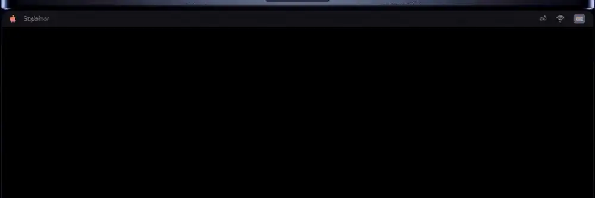

<div align="center">

<picture>
  <source media="(prefers-reduced-motion: reduce)" srcset="Assets/banner.png">
  
</picture>

**Speak words. Get text. Pretend the name was strategy.**

[](https://swift.org)
[](https://www.apple.com/macos)
[](LICENSE)

</div>

---

A tiny macOS menu-bar dictation app for people who want speech-to-text without a heavy desktop assistant sitting in memory all day.

Built from scratch in Swift and SwiftUI. Not affiliated with any commercial dictation product — this one just types what you say and then gets out of the way.

## The name

`FuguFableFlow` is what happens when you ask a product meeting to name a dictation app after three coffees and too many tabs open.

It's assembled from the most buzzwordy, clickbaity, trendjacking keywords currently contaminating our feeds, plus "Flow" — because every productivity tool must now imply enlightenment through keyboard shortcuts.

The name is maximalist. The app is not.

## What it does

Hold Right Command. Talk. Release. Whatever you said is now text in whatever app you were pointing at.

That's the whole product. The rest is polish:

- Menu-bar-only. No Dock icon, no windows in your face.
- Push-to-talk on Right Command by default. Reconfigurable in Settings.
- Auto-paste into the current app when you release the key.
- "Copy last transcript" fallback for when macOS decides Accessibility permission is a mystery.
- Smart formatting for spoken punctuation, line breaks, and the little false-starts every human makes.
- A custom dictionary, so it stops guessing "Kubernetes" as "cubanetics."
- Coding command mode — "new line," "open paren," "fat arrow," "press enter."
- Optional Command Mode for AI text transforms (off by default; more on that below).
- Optional music muting for Music, Spotify, and Spotify tabs in Chrome.
- Configurable start/stop tones and notification volume.

## Why the memory thing

Most voice tools are optimized to sit resident and volunteer help. This one is optimized to shut up until pressed. In practice, that means:

- Speech recognition is instantiated only while you're actually recording.
- Audio engine, recognition request, and recognition task all get released on stop.
- No transcript history is kept.
- No window, no webview, no Electron shell, no background assistant UI.
- A memory-pressure monitor drops recording state when the system starts complaining.

Fresh idle launches usually land in the low tens of MB, depending on hardware, permissions, audio devices, and which frameworks macOS has already paged in. The point isn't hitting a specific number — it's not being the app using 400 MB to do nothing.

Check for yourself:

```bash
ps -o pid,rss,command -p "$(pgrep -x FuguFableFlow)"
```

(`rss` is in KB. Activity Monitor is easier if you don't want to do math.)

## Install

Grab the latest `.zip` from the [**Releases**](https://github.com/mattyatplay-coder/FuguFableFlow/releases/latest) page — a universal build that runs on both Apple Silicon and Intel Macs.

```bash
# unzip, move to Applications, and clear the quarantine flag
unzip ~/Downloads/FuguFableFlow-*.zip -d ~/Downloads
xattr -dr com.apple.quarantine ~/Downloads/FuguFableFlow.app
mv ~/Downloads/FuguFableFlow.app /Applications/
open /Applications/FuguFableFlow.app
```

The build is ad-hoc signed, not notarized, so macOS Gatekeeper will block a normal double-click. The `xattr` line above clears the quarantine flag; alternatively, right-click the app → **Open** the first time. Prefer to build it yourself? See [Build and run](#build-and-run).

## Requirements

- macOS 14 or newer
- Swift 6 toolchain (Xcode or command line tools)
- Microphone permission
- Speech Recognition permission
- Accessibility permission — for pasting into other apps
- Optional: API key if you turn on a hosted Command Mode provider

## Build and run

```bash
git clone https://github.com/mattyatplay-coder/FuguFableFlow.git
cd FuguFableFlow
./script/build_and_run.sh
```

The script builds a signed local app bundle at `dist/FuguFableFlow.app` using ad-hoc signing by default.

To use a real Apple signing identity:

```bash
FUGUFABLEFLOW_CODESIGN_IDENTITY="Apple Development: Your Name (TEAMID)" ./script/build_and_run.sh
```

To install manually:

```bash
rm -rf /Applications/FuguFableFlow.app
ditto dist/FuguFableFlow.app /Applications/FuguFableFlow.app
open /Applications/FuguFableFlow.app
```

## Shortcuts

| Action | Default |
|---|---|
| Push-to-talk dictation | Right Command (hold) |
| Command Mode | Control + Option + Command (hold) |

The dictation shortcut is reconfigurable in Settings.

## Command Mode (optional)

Off by default. When on, it can:

- Replace highlighted text with a cleaned-up or transformed version.
- Generate text at the cursor when nothing is selected.
- Follow spoken instructions like "make this more concise" or "turn this into a bulleted list."

Provider options:

- **Off** — does nothing. Default.
- **OpenRouter** — hosted, cheap, lots of free routing options.
- **Hugging Face** — hosted open models via HF Inference Providers.
- **OpenAI** — hosted, standard chat completions.
- **Local Ollama** — talks to an already-running Ollama server at `localhost`. The app doesn't start Ollama or bundle a model; that part's on you.

Hosted providers receive the selected text and your spoken command — nothing else. Provider keys live in the macOS Keychain. Don't commit them.

Local Ollama keeps Command Mode requests on-device, but the Ollama model process runs in its own memory outside FuguFableFlow. If it's using 8 GB, that's Ollama, not this app.

## Permissions, and where macOS hides them

- **Microphone** — obvious.
- **Speech Recognition** — lets Apple's recognizer actually transcribe.
- **Accessibility** — required to paste into other apps.
- **Automation** — only needed if you want music-muting for Music, Spotify, or Chrome.

If paste stops working, it's almost always Accessibility. If you rebuilt or reinstalled an ad-hoc signed copy, macOS treats every rebuild as a new privacy identity even when the app name and bundle ID look identical. Remove the old `FuguFableFlow` entry from **System Settings → Privacy & Security → Accessibility**, add the new `/Applications/FuguFableFlow.app` back, and enable it.

Spotify-in-Chrome muting also needs Chrome's **View → Developer → Allow JavaScript from Apple Events** setting turned on before FuguFableFlow can pause the web player.

## Privacy

- No backend. No analytics. No telemetry.
- Normal dictation uses Apple's Speech framework and follows Apple's speech-recognition behavior for your Mac and OS version.
- Command Mode is off by default. When on and pointed at a hosted provider, only the selected text and your spoken instruction are sent.
- Local Ollama keeps Command Mode requests local.
- No transcript history is stored in the app.
- Settings live in local macOS preferences. Provider keys live in Keychain.
- Diagnostic logs avoid transcript content and record operational status, lengths, permissions, and errors.

See [SECURITY.md](SECURITY.md) for the current privacy/security audit summary.

## License

Apache License 2.0. See [LICENSE](LICENSE).
